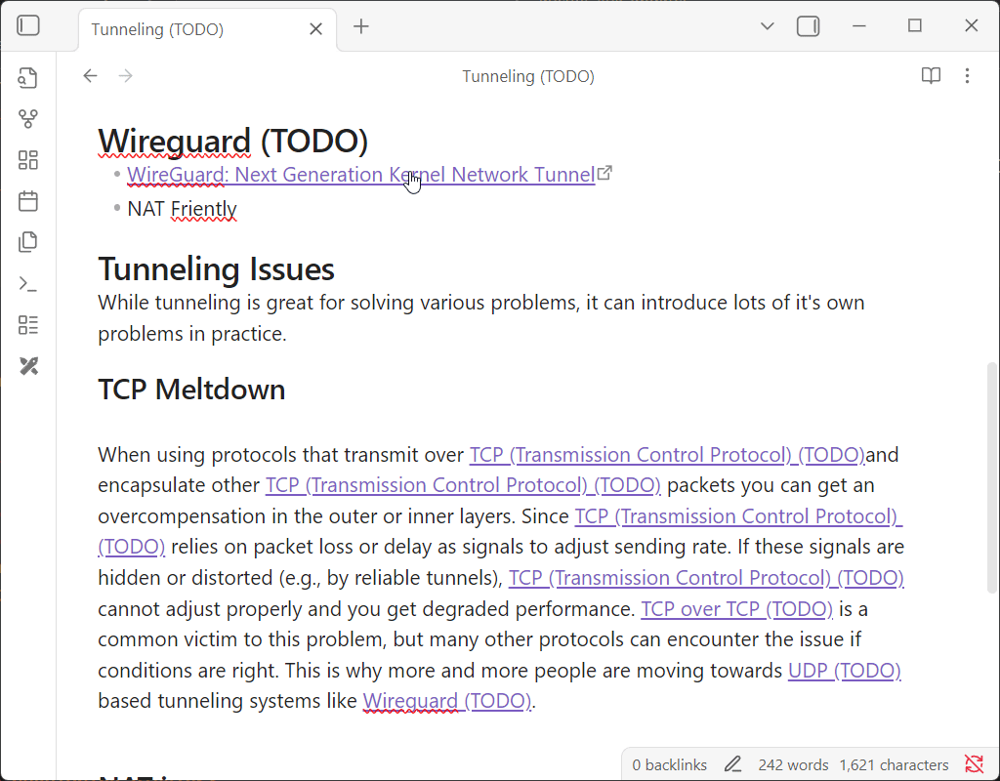

# Anchor Link Updater

This project seeks to solve the problem of internal heading links (anchor links) not being updated. It will watch for changes in your headings, and when they happen it will update your wikilinks. 

So if you have a document with:

```md
## Wireguard (TODO)
...


## Other content

This is a link to [[#Wireguard (TODO)]] and a link with an alias like this [[#Wireguard (TODO)|Wireguard]].
```

If you update the `## Wireguard (TODO)` to `## Wireguard` it will update your links:

```md
## Wireguard
...


## Other content

This is a link to [[#Wireguard]] and a link with an alias like this [[#Wireguard|Wireguard]].
```

Demo



## Contribution Guide

If you find a bug feel free to submit an issue on the github page, and/or file a PR. To work with the project make your changes in `main.ts` (you'll need to run `npm i` if you haven't run the project before), then run `npm run dev` and copy `main.ts`, `manifest.json` and `styles.css` into your plugin folder (`<vault path>/.obsidian/plugins/anchor-link-updater`), then refresh your plugins.
